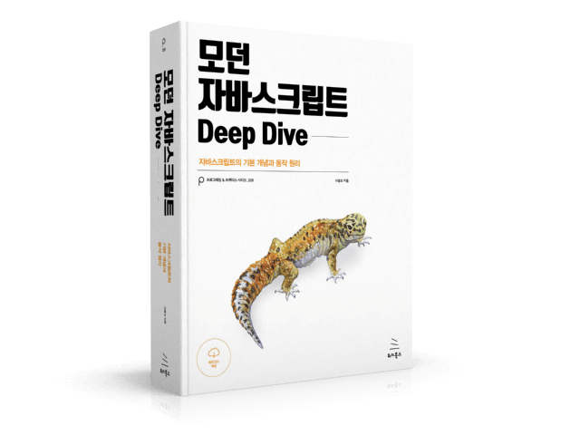

# 자바스크립트의 기초 문법 정리 ( ES6+ 심화 문법 )
 기존의 repository를 삭제 후 다시 초심으로 돌아가 처음부터 git, javaScript, 다양한 SPA 프레임 워크를 배워 보려고 한다. 

##  계획 
***
javascript는 밑 그림을 그리는 작업
희미하지만 제일 열을 다 해야 하는 작업 이라고 생각한다. 

### 1. JS 코어 문법

- Dream Coding Ellie
> https://www.youtube.com/c/%EB%93%9C%EB%A6%BC%EC%BD%94%EB%94%A9by%EC%97%98%EB%A6%AC

유튜브의 무료강의 이지만 양질의 조화가 잘 어우러진 강의,

추후 엘리 쌤의 node 강의를 들을 예정이라 더욱 열심히 들어야 한다. 

- ZeroCho TV
> https://www.youtube.com/c/ZeroChoTV/

Node.js 교과서의 저자로써 자바스크립트 및 node 또는 리액트에 있어서 배울 점이 많은 개발자 선생님 유튜버(?)

- NomadCoder
> https://www.nomadcoders.co/

클론코딩의 대가, 기초를 쌓기에는 좋다!
처음에 멋모르고 따라하다가는 큰코 다치더라...

- 모던 자바스크립트 Deep Dive

yes24 에서 eBook 으로 구매

### 2. Toy Project 

- 위의 영상들과 정리한 문법들을 응용해 어떠한 프레임 워크나 라이브러리의 사용을 받지 않고 간단한 웹페이지 구현

### 3. 다양한 SPA FrameWork
### 4. TypeScript

macBook air 
